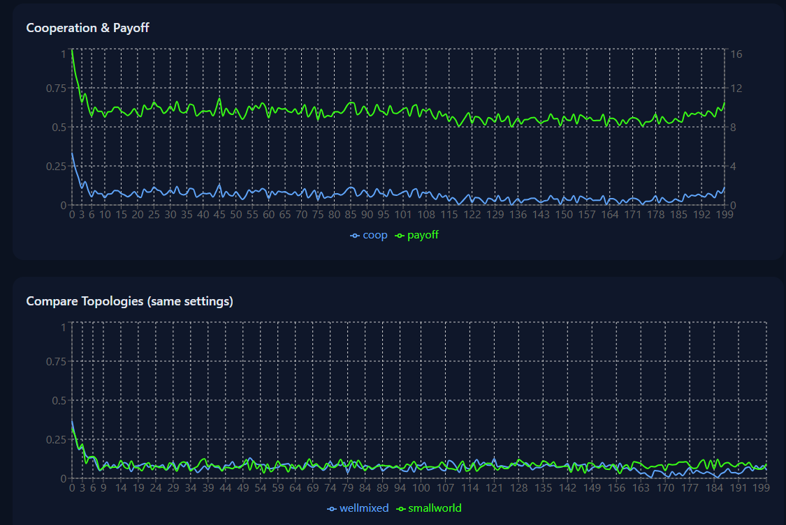
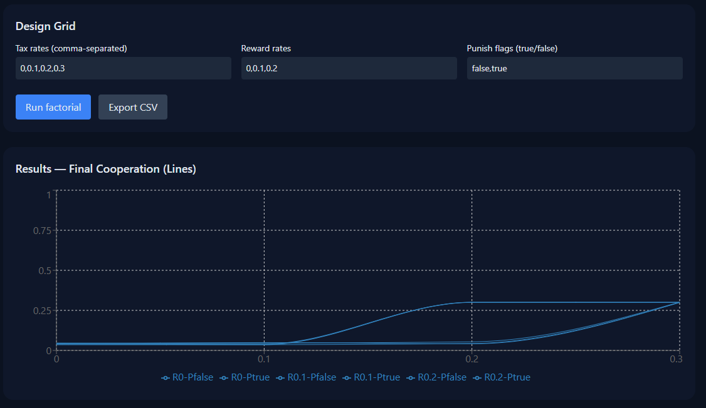

# **Conflux** — *Small-worlds create local confluences whose behaviors spread.*

> An interactive lab for **public-goods dynamics**.  
> Simulate networks, tune **tax / reward / punishment**, add **noise**, and watch cooperation emerge (or collapse) in real time.  
> Built with **Next.js 14 (App Router)** + **TypeScript** + **Tailwind**.

<p align="center">
  <a href="https://nextjs.org/"></a>
  <a href="https://www.typescriptlang.org/"></a>
  <a href="https://tailwindcss.com/"></a>
  <a href="https://tinyurl.com/conflux"></a>
</p>

---

## 🔗 Conflux — Live
**Try it now:** https://tinyurl.com/conflux

- **Home** — interactive simulator (sliders/toggles)
- **Experiments** — factorial sweeps with **line charts**, **heatmap**, and **CSV export**
- **Compare Topologies** — overlay **well-mixed** vs **small-world**
- **About** — model overview, parameter meanings, FAQ
- **Contact** — LinkedIn, GitHub, and email

---

## 🧭 Table of Contents
- [Features](#-features)
- [Screenshots](#-screenshots)
- [Quick Start](#-quick-start)
- [Project Structure](#-project-structure)
- [Model Overview](#-model-overview)
- [Parameters & Implications](#-parameters--implications)
- [Pages](#-pages)
- [Serverless API](#-serverless-api)
- [Notes & Performance](#-notes--performance)
- [Roadmap](#-roadmap)
- [Contributing](#-contributing)
- [License](#-license)
- [Contact](#-contact)

---

## 🌟 Features
- **Mechanism Design Sandbox** — toggle **Tax / Reward / Punishment**, adjust **thresholds** & **rates**
- **Network Topology** — **well-mixed** ↔ **small-world** (Watts–Strogatz: `k`, `p`)
- **Behavioral Agents** — Egoists (best response), Conditional Cooperators, Punitive, Altruists
- **Noise & Learning** — execution noise (`σ_exec`), observation noise (`σ_obs`), **adaptive beliefs**
- **Visual Analytics** — time series, overlay comparisons, factorial **heatmaps** with **dynamic colorbar ticks**
- **Serverless** — `/api/run` & `/api/factorial` for ensembles and sweeps
- **CSV Export** — one-click export for offline analysis

---

## 🖼 Screenshots

> Live captures from the app (stored in `preview/`).

| Home (Simulator) | Factorial (Curve) |
|---|---|
|  |  |

---

## ⚡ Quick Start

```bash
# 1) Install
npm i

# 2) Dev server
npm run dev
# open http://localhost:3000

# 3) Production build
npm run build
npm start
```

---

## 🗂 Project Structure
```
conflux/
├── app/
│   ├── layout.tsx                # Navbar + footer + global shell
│   ├── globals.css               # Tailwind + theme
│   ├── page.tsx                  # Home (simulator + Compare Topologies)
│   ├── experiments/page.tsx      # Factorial (table + line chart + heatmap + CSV)
│   ├── about/page.tsx            # About & FAQ (parameters explained)
│   └── contact/page.tsx          # Contact (LinkedIn, GitHub, Email)
│
├── app/api/
│   ├── run/route.ts              # POST /api/run       -> ensemble stats
│   └── factorial/route.ts        # POST /api/factorial -> sweep grid
│
├── lib/sim.ts                    # Core simulation: agents, topology, ensemble, factorial
├── preview/                      # README screenshots (PNG)
├── public/                       # (logos/og images if desired)
├── tailwind.config.js
├── postcss.config.js
├── next.config.js
├── tsconfig.json
├── package.json
└── README.md
```

---

## 🧠 Model Overview
**Public Goods Game (PGG).** Each round:
- Players \(n\) receive endowment \(w\) and choose \(c_i \in [0,w]\).
- Total contributions \(C = \sum_i c_i\) are multiplied by MPCR \(a\) and redistributed.
- **Mechanisms** add incentives:
  - **Tax** on low contributors (below threshold \( \tau \))
  - **Reward** for high contributors (above threshold \( \rho \))
  - **Punishment** as an **expected risk** (fast, UI-friendly)
- **Topology** shapes interaction:
  - **Well-mixed** — everyone interacts with everyone
  - **Small-world** — local neighborhoods with rewiring \((k, p)\)
- **Learning** — agents adapt beliefs about the average contribution (adaptive EMA).
- **Noise** — execution & observation jitter.

---

## 🧾 Parameters & Implications

| Group | Param | Meaning | Insight |
|---|---|---|---|
| Core | `n` | Population size | Larger \(n\) dilutes returns; cooperation harder without incentives. |
|  | `w` | Endowment per round | Upper bound for contribution. |
|  | `a` | MPCR | If \(a<1\), egoists defect unless mechanisms change payoffs. |
|  | `T` | Rounds | Longer horizons → beliefs stabilize. |
| Noise | `sigmaExec` | Execution noise | Trembling-hand; adds jitter. |
|  | `sigmaObs` | Observation noise | Misclassification risk under punishment. |
| Tax | `tax.enabled` | Toggle | Penalize under-contributors. |
|  | `tax.threshold (τ)` | Threshold for “low” | Higher τ is harsher. |
|  | `tax.rate` | Rate on \(w-c\) | Stronger taxes deter free-riding; too high can hurt welfare. |
| Reward | `reward.enabled` | Toggle | Encourage generosity. |
|  | `reward.threshold (ρ)` | Threshold for “high” | Lower ρ spreads rewards broadly. |
|  | `reward.rate` | Rate on \(c\) | Often lifts both cooperation and welfare. |
| Punish | `punish.enabled` | Toggle | Expected penalty for defectors. |
|  | `punish.fine` | Fine magnitude | Drives compliance; can depress welfare if it misfires under noise. |
|  | `punish.fracPunishers` | Punisher share | More punishers → stronger deterrence. |
| Topology | `topology.type` | `wellmixed` or `smallworld` | Small-world supports cooperative clusters. |
|  | `k` | Degree (even) | Bigger \(k\) = broader neighborhood. |
|  | `p` | Rewire probability | Higher \(p\) shortens paths, mixes behavior faster. |

---

## 📄 Pages
- **/** — Simulator  
  Sliders/toggles for mechanisms, noise, topology; time-series for **Cooperation** (blue) and **Payoff** (neon green); **Compare Topologies** overlay (blue = well-mixed, neon green = small-world).
- **/experiments** — Factorial  
  Define grid (tax × reward × punish), run sweeps, view **line chart**, **heatmap with dynamic colorbar ticks**, and **export CSV**.
- **/about** — About & FAQ  
  Friendly primer on the model and each parameter.
- **/contact** — Contact  
  Clean cards linking LinkedIn, GitHub, and email.

---

## 🔌 Serverless API

### `POST /api/run`
Run an **ensemble** for a single config.
```json
{
  "n":10,"w":10,"a":0.3,"T":150,
  "sigmaExec":0.2,"sigmaObs":0.0,
  "tax":{"enabled":true,"threshold":0.3,"rate":0.2},
  "reward":{"enabled":false,"threshold":0.7,"rate":0.0},
  "punish":{"enabled":true,"cost":0.2,"fine":0.8,"fracPunishers":0.3},
  "mix":{"CC":5,"Egoist":5,"Punitive":0,"Altruist":0},
  "topology":{"type":"wellmixed","k":4,"p":0.1}
}
```

### `POST /api/factorial`
Sweep **tax rates × reward rates × punish flags**.
```json
{
  "base": { /* same shape as above */ },
  "taxRates": [0,0.1,0.2,0.3],
  "rewardRates": [0,0.1,0.2],
  "punishFlags": [false,true]
}
```

---

## 📝 Notes & Performance
- UI tuned for **n≈10** and **T≈150–200**.  
  For larger settings, prefer the API and visualize results incrementally.
- Serverless functions keep ensemble sizes modest to avoid cold-start delays.
- Charts use **Recharts**; colors chosen for dark backgrounds (blue + neon green).

---

## 🗺 Roadmap
> Feature-focused (broader items; ✓ = already shipped)

- ✓ **Mechanism suite with thresholds** — tax, reward, punishment (τ & ρ supported)  
- ✓ **Small-world topology & local public goods** — Watts–Strogatz (`k`, `p`), neighborhood payoffs  
- ✓ **Factorial design & export** — parameter sweeps, summary table, CSV for analysis  
- ☐ **Explicit two-stage punishment & calibration** — decision + execution stages; fit to human data  
- ☐ **Reputation & institutional dynamics** — indirect reciprocity, evolving rules/mechanisms

---

## 🤝 Contributing
PRs welcome!

1. Open an issue describing the change.
2. Keep code **typed** (TypeScript) and **lint-clean**.
3. Include a short **before/after** screenshot if it touches UI.

```bash
npm i
npm run dev
npm run build
```

---

## 📜 License
MIT — do anything, just keep the license and attribution.

---

## 📬 Contact
- **Live:** https://tinyurl.com/conflux  
- **LinkedIn:** [@LinkedIn/KKSChauhan](https://www.linkedin.com/in/kkschauhan)  
- **GitHub:** [@GitHub/KKSChauhan](https://github.com/kkschauhan)  
- **Email:** kshitij7chauhan@gmail.com

> If you use Conflux in a talk, course, or write-up — I’d love to see it!
